Alejandra\_hw03\_gapminder
================

## Advance exploration and use of dplyr on the gapminder dataset

This is an R Markdown document used for exploring and manipulating the
`gapminder` dataset through the functions of the `dplyr` and `ggplot2`
packages. This document is intended to serve as a “cheat-sheet” for
future work on R.

## Loading data and required libraries

``` r
library(gapminder)
library(ggplot2)
library(dplyr)
library(kableExtra)
library(gridExtra)
library(tidyr)
```

In a previous
[repository](https://github.com/STAT545-UBC-students/hw02-aleurcelay/blob/master/hw02_gapminder_dplyr.md)
I described the basics of the gapminder dataset, but here is the head of
the table to remember the idea of it. We can see the variables of the
data set and the first rows.

``` r
kable(head(gapminder)) %>%      #To create a table
kable_styling(full_width = FALSE)   #Improve table format           
```

<table class="table" style="width: auto !important; margin-left: auto; margin-right: auto;">

<thead>

<tr>

<th style="text-align:left;">

country

</th>

<th style="text-align:left;">

continent

</th>

<th style="text-align:right;">

year

</th>

<th style="text-align:right;">

lifeExp

</th>

<th style="text-align:right;">

pop

</th>

<th style="text-align:right;">

gdpPercap

</th>

</tr>

</thead>

<tbody>

<tr>

<td style="text-align:left;">

Afghanistan

</td>

<td style="text-align:left;">

Asia

</td>

<td style="text-align:right;">

1952

</td>

<td style="text-align:right;">

28.801

</td>

<td style="text-align:right;">

8425333

</td>

<td style="text-align:right;">

779.4453

</td>

</tr>

<tr>

<td style="text-align:left;">

Afghanistan

</td>

<td style="text-align:left;">

Asia

</td>

<td style="text-align:right;">

1957

</td>

<td style="text-align:right;">

30.332

</td>

<td style="text-align:right;">

9240934

</td>

<td style="text-align:right;">

820.8530

</td>

</tr>

<tr>

<td style="text-align:left;">

Afghanistan

</td>

<td style="text-align:left;">

Asia

</td>

<td style="text-align:right;">

1962

</td>

<td style="text-align:right;">

31.997

</td>

<td style="text-align:right;">

10267083

</td>

<td style="text-align:right;">

853.1007

</td>

</tr>

<tr>

<td style="text-align:left;">

Afghanistan

</td>

<td style="text-align:left;">

Asia

</td>

<td style="text-align:right;">

1967

</td>

<td style="text-align:right;">

34.020

</td>

<td style="text-align:right;">

11537966

</td>

<td style="text-align:right;">

836.1971

</td>

</tr>

<tr>

<td style="text-align:left;">

Afghanistan

</td>

<td style="text-align:left;">

Asia

</td>

<td style="text-align:right;">

1972

</td>

<td style="text-align:right;">

36.088

</td>

<td style="text-align:right;">

13079460

</td>

<td style="text-align:right;">

739.9811

</td>

</tr>

<tr>

<td style="text-align:left;">

Afghanistan

</td>

<td style="text-align:left;">

Asia

</td>

<td style="text-align:right;">

1977

</td>

<td style="text-align:right;">

38.438

</td>

<td style="text-align:right;">

14880372

</td>

<td style="text-align:right;">

786.1134

</td>

</tr>

</tbody>

</table>

According to its documentation, `dplyr` aims to provide a function for
each basic verb of data manipulation:

  - filter( ) to select cases based on their values.
  - arrange( ) to reorder the cases.
  - select( ) and rename( ) to select variables based on their names.
  - mutate( ) and transmute( ) to add new variables that are functions
    of existing variables.
  - summarize( ) to condense multiple values to a single value.
  - sample\_n( ) and sample\_frac( ) to take random samples.

One more function that is not part of the *main* functions (I don’t know
why) is:

  - group\_by( ) to put together information based on another variable

So lets, say that we want to:

-----

## 1\. Get the maximum and minimum of GDP per capita for all continents.

We first need to make groups of the continents and then get their
maximum and minimum values of GDP by applying a `summarize()`
function

``` r
by_continent <- group_by(gapminder, continent) # create a group of the data by continent
gdp_max_min <- summarize(by_continent, # get the max and min values of the GDP variable for each continent
                        max_GDP = max(gdpPercap),
                        min_GDP = min(gdpPercap))
kable(gdp_max_min) %>% #create a table for data display
    kable_styling(full_width = FALSE, position = "center") #improve table format
```

<table class="table" style="width: auto !important; margin-left: auto; margin-right: auto;">

<thead>

<tr>

<th style="text-align:left;">

continent

</th>

<th style="text-align:right;">

max\_GDP

</th>

<th style="text-align:right;">

min\_GDP

</th>

</tr>

</thead>

<tbody>

<tr>

<td style="text-align:left;">

Africa

</td>

<td style="text-align:right;">

21951.21

</td>

<td style="text-align:right;">

241.1659

</td>

</tr>

<tr>

<td style="text-align:left;">

Americas

</td>

<td style="text-align:right;">

42951.65

</td>

<td style="text-align:right;">

1201.6372

</td>

</tr>

<tr>

<td style="text-align:left;">

Asia

</td>

<td style="text-align:right;">

113523.13

</td>

<td style="text-align:right;">

331.0000

</td>

</tr>

<tr>

<td style="text-align:left;">

Europe

</td>

<td style="text-align:right;">

49357.19

</td>

<td style="text-align:right;">

973.5332

</td>

</tr>

<tr>

<td style="text-align:left;">

Oceania

</td>

<td style="text-align:right;">

34435.37

</td>

<td style="text-align:right;">

10039.5956

</td>

</tr>

</tbody>

</table>

After getting those results, I was also interested in knowing the
countries with such maximum and minimum values. While I was searching
for a way to include the countries, I found another way to get the
maximum and minimum values by applying a filter and specifically search
for such values by keeping the corresponding countries. This method
however, outputs 2 different tables, one for the maximum, and another
for the minimum:

``` r
#Table and plot for Max GDP
Max_GDP <- filter(by_continent, gdpPercap == max(gdpPercap)) %>%
                select(continent, country, max_GDP = gdpPercap) %>% # select and/or rename variables
                    arrange(desc(max_GDP)) #re order from high to low

plot_max <- ggplot(Max_GDP, aes(continent, max_GDP, color = country)) +
                geom_bar(stat = 'identity')

grid.arrange(tableGrob(Max_GDP), plot_max, nrow = 1) #table next to plot
```

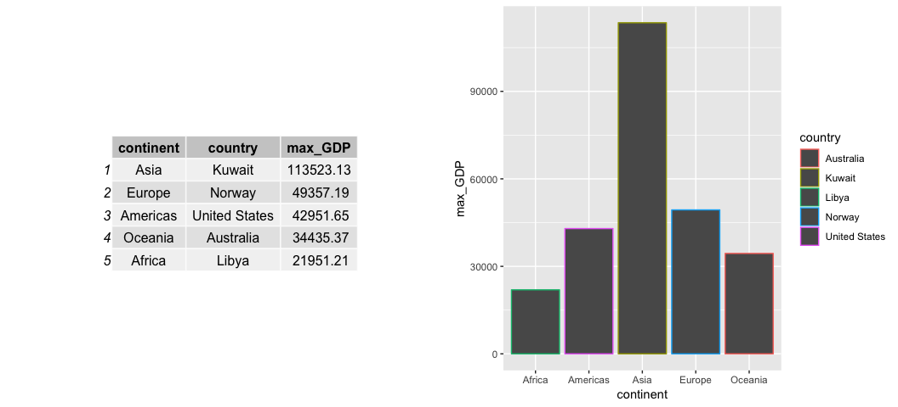

``` r
#Table and plot for Min GDP

Min_GDP <- filter(by_continent, gdpPercap == min(gdpPercap)) %>%
                select(continent, country, min_GDP = gdpPercap) %>%
                    arrange(min_GDP)    #re order from low to high

plot_min <- ggplot(Min_GDP, aes(continent, min_GDP, color = country)) +
                geom_bar(stat = 'identity')

grid.arrange(tableGrob(Min_GDP), plot_min, nrow = 1) #table next to plot
```

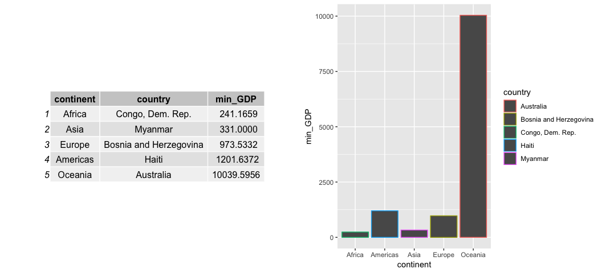

``` r
ggplot() +
    geom_point(data = Max_GDP, aes(continent, max_GDP, color = country), 
                shape = 17, size = 5) +
    geom_point(data = Min_GDP, aes(continent, min_GDP, color = country),
                shape = 19, size = 5) +
    labs(x = "", y = 'GDP per capita',
        title = "Max and Min GDP by continent") +
    theme(legend.position="top", legend.title=element_blank()) +
    scale_y_log10() +
    annotation_logticks(sides = "l")
```

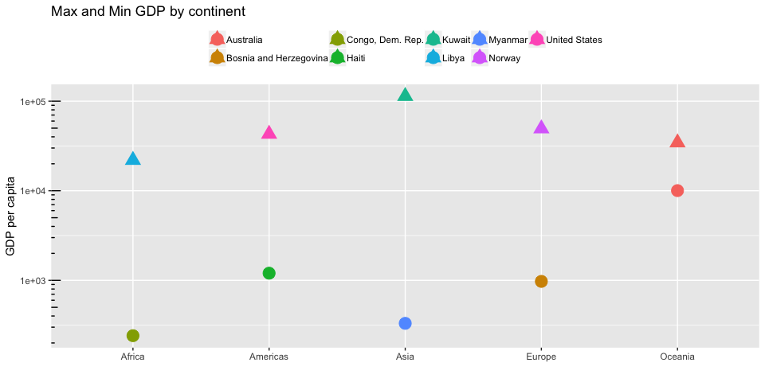

The problem encountered with the past graph was to fix the legend
overlay. Another idea that I had was to put annotations with the name of
the country in each point (using `geom_text(aes(label=country)`, but
that didn’t work.

To fix that, I thought about making my dataset **tidy** as follows:

``` r
Min_Max <- bind_rows(Max_GDP, Min_GDP) %>%
    gather(key = Max_Min, value = 'GDP', max_GDP, min_GDP) %>%
    na.omit()
kable(Min_Max) %>%
    kable_styling(full_width = FALSE, position = "center")
```

<table class="table" style="width: auto !important; margin-left: auto; margin-right: auto;">

<thead>

<tr>

<th style="text-align:left;">

continent

</th>

<th style="text-align:left;">

country

</th>

<th style="text-align:left;">

Max\_Min

</th>

<th style="text-align:right;">

GDP

</th>

</tr>

</thead>

<tbody>

<tr>

<td style="text-align:left;">

Asia

</td>

<td style="text-align:left;">

Kuwait

</td>

<td style="text-align:left;">

max\_GDP

</td>

<td style="text-align:right;">

113523.1329

</td>

</tr>

<tr>

<td style="text-align:left;">

Europe

</td>

<td style="text-align:left;">

Norway

</td>

<td style="text-align:left;">

max\_GDP

</td>

<td style="text-align:right;">

49357.1902

</td>

</tr>

<tr>

<td style="text-align:left;">

Americas

</td>

<td style="text-align:left;">

United States

</td>

<td style="text-align:left;">

max\_GDP

</td>

<td style="text-align:right;">

42951.6531

</td>

</tr>

<tr>

<td style="text-align:left;">

Oceania

</td>

<td style="text-align:left;">

Australia

</td>

<td style="text-align:left;">

max\_GDP

</td>

<td style="text-align:right;">

34435.3674

</td>

</tr>

<tr>

<td style="text-align:left;">

Africa

</td>

<td style="text-align:left;">

Libya

</td>

<td style="text-align:left;">

max\_GDP

</td>

<td style="text-align:right;">

21951.2118

</td>

</tr>

<tr>

<td style="text-align:left;">

Africa

</td>

<td style="text-align:left;">

Congo, Dem. Rep.

</td>

<td style="text-align:left;">

min\_GDP

</td>

<td style="text-align:right;">

241.1659

</td>

</tr>

<tr>

<td style="text-align:left;">

Asia

</td>

<td style="text-align:left;">

Myanmar

</td>

<td style="text-align:left;">

min\_GDP

</td>

<td style="text-align:right;">

331.0000

</td>

</tr>

<tr>

<td style="text-align:left;">

Europe

</td>

<td style="text-align:left;">

Bosnia and Herzegovina

</td>

<td style="text-align:left;">

min\_GDP

</td>

<td style="text-align:right;">

973.5332

</td>

</tr>

<tr>

<td style="text-align:left;">

Americas

</td>

<td style="text-align:left;">

Haiti

</td>

<td style="text-align:left;">

min\_GDP

</td>

<td style="text-align:right;">

1201.6372

</td>

</tr>

<tr>

<td style="text-align:left;">

Oceania

</td>

<td style="text-align:left;">

Australia

</td>

<td style="text-align:left;">

min\_GDP

</td>

<td style="text-align:right;">

10039.5956

</td>

</tr>

</tbody>

</table>

Now, lets make the graph again and put it together with a
table:

``` r
plot1 <- ggplot() + #plot variable so I can put it nex to the table later
            geom_point(data = Min_Max, aes(continent, GDP, color = Max_Min), #use Min_Max table
                        shape = 17, size = 5) +
            labs(x = "", y = 'GDP per capita', # change labels 
                title = "Max and Min GDP by continent") + # add title to the plot
            expand_limits(y = c(0, 140000)) + # expand y limits to have the full label of Kuwait
            geom_text(data = Min_Max, # data for labels
                    aes(continent, GDP, # labels location
                            label = country, # labels based on country
                            hjust = 0.3, vjust=-1.3)) + # adjust the place of the labels
            theme(legend.position="top", legend.title=element_blank()) + # set legend position
            scale_y_log10() + #change y axis to log10 scale
            annotation_logticks(sides = "l") #change ticks format
grid.arrange(tableGrob(gdp_max_min), plot1, nrow = 1) #table next to plot
```

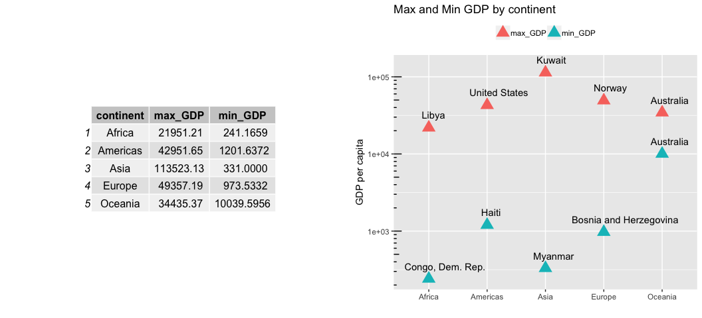

## Now, I can see in the plot which countries correspond to the minimum and maximum values in each continent. Notice that this plot and table include all years of data, that is why Australia is repeated.

## 2\. Look at the spread of GDP per capita within the continents.

Now, lets take a look at the distribution of GDP per capita in each
continent. We already have already a variable storing the data grouped
by continents `by_continent`, so lets plot that:

``` r
ggplot(by_continent, aes(continent, gdpPercap, color = year)) +
    geom_jitter() + # sparse the point data to make it more visible
    labs(y = "GDP per capita", #change labels and add title
         x = "Continent", 
         title = "Scatter points of GDP per capita by continent")
```

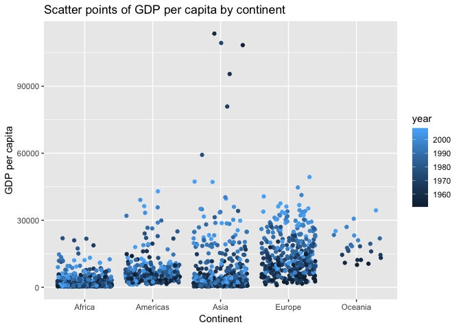

While the plot above allows to see the spread of GDP per capita within
each continent, it is hard to get some basic statistics from it. Let’s
get them on a table:

``` r
# get summary statistics of GDP variable for each continent
by_continent.sum <- summarize(by_continent,
                        min_GDP = min(gdpPercap),
                        q25 = quantile(gdpPercap, 0.25),
                        median = median(gdpPercap),
                        mean = mean(gdpPercap),
                        sd = sd(gdpPercap),
                        q75 = quantile(gdpPercap, 0.75),
                        max_GDP = max(gdpPercap))
kable(by_continent.sum) %>% #create a table for data display
    kable_styling(full_width = FALSE, position = "center")
```

<table class="table" style="width: auto !important; margin-left: auto; margin-right: auto;">

<thead>

<tr>

<th style="text-align:left;">

continent

</th>

<th style="text-align:right;">

min\_GDP

</th>

<th style="text-align:right;">

q25

</th>

<th style="text-align:right;">

median

</th>

<th style="text-align:right;">

mean

</th>

<th style="text-align:right;">

sd

</th>

<th style="text-align:right;">

q75

</th>

<th style="text-align:right;">

max\_GDP

</th>

</tr>

</thead>

<tbody>

<tr>

<td style="text-align:left;">

Africa

</td>

<td style="text-align:right;">

241.1659

</td>

<td style="text-align:right;">

761.247

</td>

<td style="text-align:right;">

1192.138

</td>

<td style="text-align:right;">

2193.755

</td>

<td style="text-align:right;">

2827.930

</td>

<td style="text-align:right;">

2377.417

</td>

<td style="text-align:right;">

21951.21

</td>

</tr>

<tr>

<td style="text-align:left;">

Americas

</td>

<td style="text-align:right;">

1201.6372

</td>

<td style="text-align:right;">

3427.779

</td>

<td style="text-align:right;">

5465.510

</td>

<td style="text-align:right;">

7136.110

</td>

<td style="text-align:right;">

6396.764

</td>

<td style="text-align:right;">

7830.210

</td>

<td style="text-align:right;">

42951.65

</td>

</tr>

<tr>

<td style="text-align:left;">

Asia

</td>

<td style="text-align:right;">

331.0000

</td>

<td style="text-align:right;">

1056.993

</td>

<td style="text-align:right;">

2646.787

</td>

<td style="text-align:right;">

7902.150

</td>

<td style="text-align:right;">

14045.373

</td>

<td style="text-align:right;">

8549.256

</td>

<td style="text-align:right;">

113523.13

</td>

</tr>

<tr>

<td style="text-align:left;">

Europe

</td>

<td style="text-align:right;">

973.5332

</td>

<td style="text-align:right;">

7213.085

</td>

<td style="text-align:right;">

12081.749

</td>

<td style="text-align:right;">

14469.476

</td>

<td style="text-align:right;">

9355.213

</td>

<td style="text-align:right;">

20461.386

</td>

<td style="text-align:right;">

49357.19

</td>

</tr>

<tr>

<td style="text-align:left;">

Oceania

</td>

<td style="text-align:right;">

10039.5956

</td>

<td style="text-align:right;">

14141.859

</td>

<td style="text-align:right;">

17983.304

</td>

<td style="text-align:right;">

18621.609

</td>

<td style="text-align:right;">

6358.983

</td>

<td style="text-align:right;">

22214.117

</td>

<td style="text-align:right;">

34435.37

</td>

</tr>

</tbody>

</table>

There are some more elegant and visual ways to do it. One of them is a
box plot:

``` r
ggplot(by_continent, aes(continent, gdpPercap, fill = continent)) +
    geom_boxplot() + # create boxplot 
    labs(y = "GDP per capita", #change labels and add title
         x = "Continent", 
         title = "Box plots of GDP per capita by continent") + 
    theme(legend.position = "none") #remove legend
```

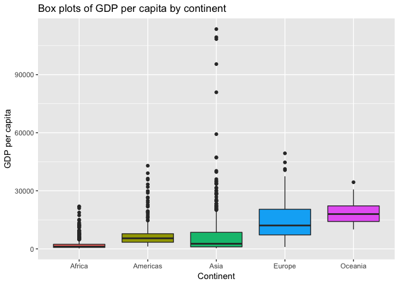

In general, GDP per capita is higher in Oceania and Europe, and lower in
Africa. However, it is interesting to see out-lier countries with high
GDP in particular y Asia.

-----

## 3\. Compute a weighted mean (by population) of life expectancy.

Lets take a ‘vanilla’ mean of life expectancy (LE) for each continent in
the last year of data (2007) and compared it with the weighted
mean.

``` r
Continents_LE <- filter(by_continent, year == '2007') %>% #filter only Americas
                summarize(Mean_LE = mean(lifeExp),#get the mean life expectancy
                          Weighted_Mean_LE = weighted.mean(lifeExp, pop)) #get the mean life expentancy weighted by population
kable(Continents_LE) %>%
    kable_styling(full_width = FALSE, position = "center")
```

<table class="table" style="width: auto !important; margin-left: auto; margin-right: auto;">

<thead>

<tr>

<th style="text-align:left;">

continent

</th>

<th style="text-align:right;">

Mean\_LE

</th>

<th style="text-align:right;">

Weighted\_Mean\_LE

</th>

</tr>

</thead>

<tbody>

<tr>

<td style="text-align:left;">

Africa

</td>

<td style="text-align:right;">

54.80604

</td>

<td style="text-align:right;">

54.56441

</td>

</tr>

<tr>

<td style="text-align:left;">

Americas

</td>

<td style="text-align:right;">

73.60812

</td>

<td style="text-align:right;">

75.35668

</td>

</tr>

<tr>

<td style="text-align:left;">

Asia

</td>

<td style="text-align:right;">

70.72848

</td>

<td style="text-align:right;">

69.44386

</td>

</tr>

<tr>

<td style="text-align:left;">

Europe

</td>

<td style="text-align:right;">

77.64860

</td>

<td style="text-align:right;">

77.89057

</td>

</tr>

<tr>

<td style="text-align:left;">

Oceania

</td>

<td style="text-align:right;">

80.71950

</td>

<td style="text-align:right;">

81.06215

</td>

</tr>

</tbody>

</table>

The resultant values of ‘vanilla’ mean does not take the population of
the countries into consideration. To include it, we can perform a
weighted mean.

Lets consider the Americas: Some of the countries with higher life
expectancy in the Americas have populations large enough to move the
average of the continent from `73.6` to `75.4` years. This is probably
because of countries like United States, Mexico, and Canada which are
among the most populated countries in the Americas and have higher life
expectancy than the vanilla mean.

``` r
by_continent %>%
    filter(continent == 'Americas', 
            year =='2007', 
            country %in% c('United States', 'Mexico', 'Canada')) %>%
        select(Continent = continent, 
               Country = country, 
               Population = pop, 
               Life_Expectancy = lifeExp) %>%
            kable() %>%
                kable_styling(full_width = FALSE, position = "center")
```

<table class="table" style="width: auto !important; margin-left: auto; margin-right: auto;">

<thead>

<tr>

<th style="text-align:left;">

Continent

</th>

<th style="text-align:left;">

Country

</th>

<th style="text-align:right;">

Population

</th>

<th style="text-align:right;">

Life\_Expectancy

</th>

</tr>

</thead>

<tbody>

<tr>

<td style="text-align:left;">

Americas

</td>

<td style="text-align:left;">

Canada

</td>

<td style="text-align:right;">

33390141

</td>

<td style="text-align:right;">

80.653

</td>

</tr>

<tr>

<td style="text-align:left;">

Americas

</td>

<td style="text-align:left;">

Mexico

</td>

<td style="text-align:right;">

108700891

</td>

<td style="text-align:right;">

76.195

</td>

</tr>

<tr>

<td style="text-align:left;">

Americas

</td>

<td style="text-align:left;">

United States

</td>

<td style="text-align:right;">

301139947

</td>

<td style="text-align:right;">

78.242

</td>

</tr>

</tbody>

</table>

Lets take a graphic look at the differences between the mean and the
weighted mean for each continent.

``` r
ggplot() +
    geom_point(data = Continents_LE, aes(continent, Mean_LE),
               color = 'red', size = 3) +
    geom_point(data = Continents_LE, aes(continent, Weighted_Mean_LE), 
                color = 'blue', size = 3) +
    labs(x = '', y = 'Life Expectancy (years)',
        title = 'Mean and weigthed mean by population of life expectancy by country') +
    theme(legend.position="top", legend.title=element_blank())
```

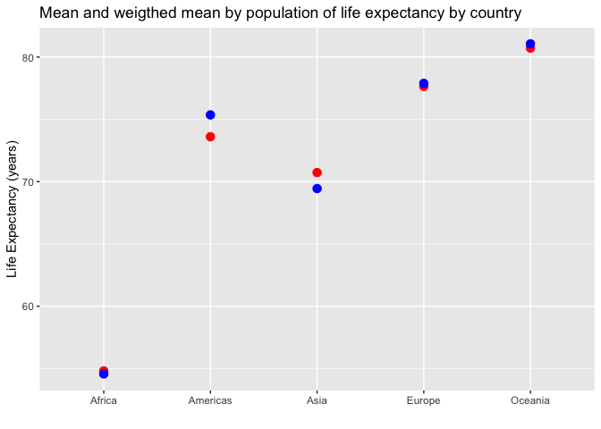

First I did that, but it was hard to add the legend for Mean and
weighted mean, so I had to do the following to fix the proble:

``` r
library(reshape2) #adding a library

names(Continents_LE) <- c('Continent', 'Mean', 'Weigthed Mean') #naming 
Continents_LE.melt <- melt(Continents_LE, id.vars = 'Continent', variable.name = 'Mean_Type', value.name = 'LifeExp')

ggplot(Continents_LE.melt) +
    geom_point(aes(x = Continent, y = LifeExp, color = Mean_Type),
                   size = 3) +
    labs(x = '', y = 'Life Expectancy (years)',
        title = 'Mean and weigthed mean by population of life expectancy by country') +
    scale_color_manual(values = c("Mean" = 'red','Weigthed Mean' = 'blue')) +
    theme(legend.position="top", legend.title=element_blank())
```

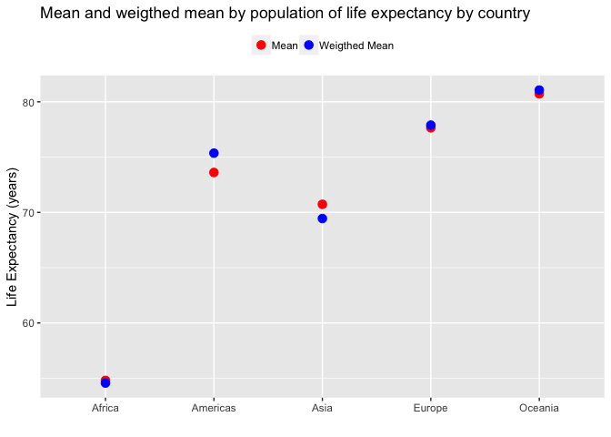

That was more complicated but at the end I undestanded what was
happening and it work. So, I’m happy
:relieved:

-----

## 4\. How is life expectancy changing over time on different continents?

Now lets take a look at the change of life expectancy over time. Lets
consider weighted averages of life expectancy by population and get the
values for every continent:

``` r
# getting weighted average of life expectancy by population
Cont_LE <-  group_by(gapminder, Continent = continent, Year = year) %>%
                summarize(Weighted_Mean_LE = weighted.mean(lifeExp, pop)) #get the mean life expectancy weighted by population 
kable(Cont_LE) %>%
    kable_styling(full_width = FALSE, position = "center")
```

<table class="table" style="width: auto !important; margin-left: auto; margin-right: auto;">

<thead>

<tr>

<th style="text-align:left;">

Continent

</th>

<th style="text-align:right;">

Year

</th>

<th style="text-align:right;">

Weighted\_Mean\_LE

</th>

</tr>

</thead>

<tbody>

<tr>

<td style="text-align:left;">

Africa

</td>

<td style="text-align:right;">

1952

</td>

<td style="text-align:right;">

38.79973

</td>

</tr>

<tr>

<td style="text-align:left;">

Africa

</td>

<td style="text-align:right;">

1957

</td>

<td style="text-align:right;">

40.94031

</td>

</tr>

<tr>

<td style="text-align:left;">

Africa

</td>

<td style="text-align:right;">

1962

</td>

<td style="text-align:right;">

43.09925

</td>

</tr>

<tr>

<td style="text-align:left;">

Africa

</td>

<td style="text-align:right;">

1967

</td>

<td style="text-align:right;">

45.17721

</td>

</tr>

<tr>

<td style="text-align:left;">

Africa

</td>

<td style="text-align:right;">

1972

</td>

<td style="text-align:right;">

47.21229

</td>

</tr>

<tr>

<td style="text-align:left;">

Africa

</td>

<td style="text-align:right;">

1977

</td>

<td style="text-align:right;">

49.20883

</td>

</tr>

<tr>

<td style="text-align:left;">

Africa

</td>

<td style="text-align:right;">

1982

</td>

<td style="text-align:right;">

51.01744

</td>

</tr>

<tr>

<td style="text-align:left;">

Africa

</td>

<td style="text-align:right;">

1987

</td>

<td style="text-align:right;">

52.82479

</td>

</tr>

<tr>

<td style="text-align:left;">

Africa

</td>

<td style="text-align:right;">

1992

</td>

<td style="text-align:right;">

53.37292

</td>

</tr>

<tr>

<td style="text-align:left;">

Africa

</td>

<td style="text-align:right;">

1997

</td>

<td style="text-align:right;">

53.28327

</td>

</tr>

<tr>

<td style="text-align:left;">

Africa

</td>

<td style="text-align:right;">

2002

</td>

<td style="text-align:right;">

53.30314

</td>

</tr>

<tr>

<td style="text-align:left;">

Africa

</td>

<td style="text-align:right;">

2007

</td>

<td style="text-align:right;">

54.56441

</td>

</tr>

<tr>

<td style="text-align:left;">

Americas

</td>

<td style="text-align:right;">

1952

</td>

<td style="text-align:right;">

60.23599

</td>

</tr>

<tr>

<td style="text-align:left;">

Americas

</td>

<td style="text-align:right;">

1957

</td>

<td style="text-align:right;">

62.01806

</td>

</tr>

<tr>

<td style="text-align:left;">

Americas

</td>

<td style="text-align:right;">

1962

</td>

<td style="text-align:right;">

63.43706

</td>

</tr>

<tr>

<td style="text-align:left;">

Americas

</td>

<td style="text-align:right;">

1967

</td>

<td style="text-align:right;">

64.50630

</td>

</tr>

<tr>

<td style="text-align:left;">

Americas

</td>

<td style="text-align:right;">

1972

</td>

<td style="text-align:right;">

65.70490

</td>

</tr>

<tr>

<td style="text-align:left;">

Americas

</td>

<td style="text-align:right;">

1977

</td>

<td style="text-align:right;">

67.60591

</td>

</tr>

<tr>

<td style="text-align:left;">

Americas

</td>

<td style="text-align:right;">

1982

</td>

<td style="text-align:right;">

69.19264

</td>

</tr>

<tr>

<td style="text-align:left;">

Americas

</td>

<td style="text-align:right;">

1987

</td>

<td style="text-align:right;">

70.35814

</td>

</tr>

<tr>

<td style="text-align:left;">

Americas

</td>

<td style="text-align:right;">

1992

</td>

<td style="text-align:right;">

71.72177

</td>

</tr>

<tr>

<td style="text-align:left;">

Americas

</td>

<td style="text-align:right;">

1997

</td>

<td style="text-align:right;">

73.19154

</td>

</tr>

<tr>

<td style="text-align:left;">

Americas

</td>

<td style="text-align:right;">

2002

</td>

<td style="text-align:right;">

74.24736

</td>

</tr>

<tr>

<td style="text-align:left;">

Americas

</td>

<td style="text-align:right;">

2007

</td>

<td style="text-align:right;">

75.35668

</td>

</tr>

<tr>

<td style="text-align:left;">

Asia

</td>

<td style="text-align:right;">

1952

</td>

<td style="text-align:right;">

42.94114

</td>

</tr>

<tr>

<td style="text-align:left;">

Asia

</td>

<td style="text-align:right;">

1957

</td>

<td style="text-align:right;">

47.28835

</td>

</tr>

<tr>

<td style="text-align:left;">

Asia

</td>

<td style="text-align:right;">

1962

</td>

<td style="text-align:right;">

46.57369

</td>

</tr>

<tr>

<td style="text-align:left;">

Asia

</td>

<td style="text-align:right;">

1967

</td>

<td style="text-align:right;">

53.88261

</td>

</tr>

<tr>

<td style="text-align:left;">

Asia

</td>

<td style="text-align:right;">

1972

</td>

<td style="text-align:right;">

57.52159

</td>

</tr>

<tr>

<td style="text-align:left;">

Asia

</td>

<td style="text-align:right;">

1977

</td>

<td style="text-align:right;">

59.55648

</td>

</tr>

<tr>

<td style="text-align:left;">

Asia

</td>

<td style="text-align:right;">

1982

</td>

<td style="text-align:right;">

61.57472

</td>

</tr>

<tr>

<td style="text-align:left;">

Asia

</td>

<td style="text-align:right;">

1987

</td>

<td style="text-align:right;">

63.53710

</td>

</tr>

<tr>

<td style="text-align:left;">

Asia

</td>

<td style="text-align:right;">

1992

</td>

<td style="text-align:right;">

65.14874

</td>

</tr>

<tr>

<td style="text-align:left;">

Asia

</td>

<td style="text-align:right;">

1997

</td>

<td style="text-align:right;">

66.77092

</td>

</tr>

<tr>

<td style="text-align:left;">

Asia

</td>

<td style="text-align:right;">

2002

</td>

<td style="text-align:right;">

68.13732

</td>

</tr>

<tr>

<td style="text-align:left;">

Asia

</td>

<td style="text-align:right;">

2007

</td>

<td style="text-align:right;">

69.44386

</td>

</tr>

<tr>

<td style="text-align:left;">

Europe

</td>

<td style="text-align:right;">

1952

</td>

<td style="text-align:right;">

64.90540

</td>

</tr>

<tr>

<td style="text-align:left;">

Europe

</td>

<td style="text-align:right;">

1957

</td>

<td style="text-align:right;">

66.89364

</td>

</tr>

<tr>

<td style="text-align:left;">

Europe

</td>

<td style="text-align:right;">

1962

</td>

<td style="text-align:right;">

68.45957

</td>

</tr>

<tr>

<td style="text-align:left;">

Europe

</td>

<td style="text-align:right;">

1967

</td>

<td style="text-align:right;">

69.54963

</td>

</tr>

<tr>

<td style="text-align:left;">

Europe

</td>

<td style="text-align:right;">

1972

</td>

<td style="text-align:right;">

70.46884

</td>

</tr>

<tr>

<td style="text-align:left;">

Europe

</td>

<td style="text-align:right;">

1977

</td>

<td style="text-align:right;">

71.53989

</td>

</tr>

<tr>

<td style="text-align:left;">

Europe

</td>

<td style="text-align:right;">

1982

</td>

<td style="text-align:right;">

72.56247

</td>

</tr>

<tr>

<td style="text-align:left;">

Europe

</td>

<td style="text-align:right;">

1987

</td>

<td style="text-align:right;">

73.44717

</td>

</tr>

<tr>

<td style="text-align:left;">

Europe

</td>

<td style="text-align:right;">

1992

</td>

<td style="text-align:right;">

74.44273

</td>

</tr>

<tr>

<td style="text-align:left;">

Europe

</td>

<td style="text-align:right;">

1997

</td>

<td style="text-align:right;">

75.70849

</td>

</tr>

<tr>

<td style="text-align:left;">

Europe

</td>

<td style="text-align:right;">

2002

</td>

<td style="text-align:right;">

77.02232

</td>

</tr>

<tr>

<td style="text-align:left;">

Europe

</td>

<td style="text-align:right;">

2007

</td>

<td style="text-align:right;">

77.89057

</td>

</tr>

<tr>

<td style="text-align:left;">

Oceania

</td>

<td style="text-align:right;">

1952

</td>

<td style="text-align:right;">

69.17040

</td>

</tr>

<tr>

<td style="text-align:left;">

Oceania

</td>

<td style="text-align:right;">

1957

</td>

<td style="text-align:right;">

70.31693

</td>

</tr>

<tr>

<td style="text-align:left;">

Oceania

</td>

<td style="text-align:right;">

1962

</td>

<td style="text-align:right;">

70.98808

</td>

</tr>

<tr>

<td style="text-align:left;">

Oceania

</td>

<td style="text-align:right;">

1967

</td>

<td style="text-align:right;">

71.17848

</td>

</tr>

<tr>

<td style="text-align:left;">

Oceania

</td>

<td style="text-align:right;">

1972

</td>

<td style="text-align:right;">

71.92273

</td>

</tr>

<tr>

<td style="text-align:left;">

Oceania

</td>

<td style="text-align:right;">

1977

</td>

<td style="text-align:right;">

73.25684

</td>

</tr>

<tr>

<td style="text-align:left;">

Oceania

</td>

<td style="text-align:right;">

1982

</td>

<td style="text-align:right;">

74.58291

</td>

</tr>

<tr>

<td style="text-align:left;">

Oceania

</td>

<td style="text-align:right;">

1987

</td>

<td style="text-align:right;">

75.98107

</td>

</tr>

<tr>

<td style="text-align:left;">

Oceania

</td>

<td style="text-align:right;">

1992

</td>

<td style="text-align:right;">

77.35788

</td>

</tr>

<tr>

<td style="text-align:left;">

Oceania

</td>

<td style="text-align:right;">

1997

</td>

<td style="text-align:right;">

78.61843

</td>

</tr>

<tr>

<td style="text-align:left;">

Oceania

</td>

<td style="text-align:right;">

2002

</td>

<td style="text-align:right;">

80.16006

</td>

</tr>

<tr>

<td style="text-align:left;">

Oceania

</td>

<td style="text-align:right;">

2007

</td>

<td style="text-align:right;">

81.06215

</td>

</tr>

</tbody>

</table>

I didn’t like the display of the table above, because it was to long to
scroll, so I thought about the following way to better display the
information.

``` r
# better display of table
Africa_LE <- filter(Cont_LE, Continent == 'Africa') #filter Africa 
Americas_LE <- filter(Cont_LE, Continent == 'Americas') #filter Americas 
Asia_LE <- filter(Cont_LE, Continent == 'Asia') #filter Asia 
Europe_LE <- filter(Cont_LE, Continent == 'Europe') #filter Europa 
Oceania_LE <- filter(Cont_LE, Continent == 'Oceania') #filter Oceania 

# make a separte table for each continent and put them in 2 rows
grid.arrange(tableGrob(Africa_LE), 
             tableGrob(Americas_LE), 
             tableGrob(Asia_LE), 
             tableGrob(Europe_LE), 
             tableGrob(Oceania_LE),  
             nrow = 2)
```

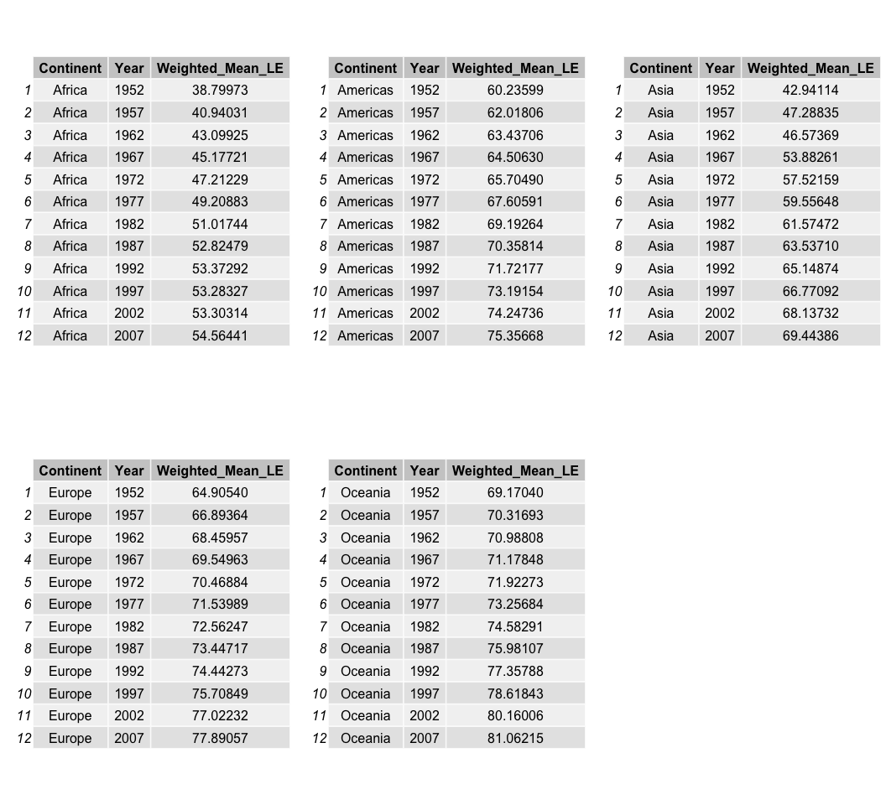

To visualize the data, lets create a plot.

``` r
ggplot(Cont_LE, aes(Year, Weighted_Mean_LE, color = Continent)) +
    geom_point() +
    labs(y = "Life Expectancy (Years)", #change labels and add title
         x = "", 
         title = "Life Expectancy change over time in different continents") +
    geom_line()
```

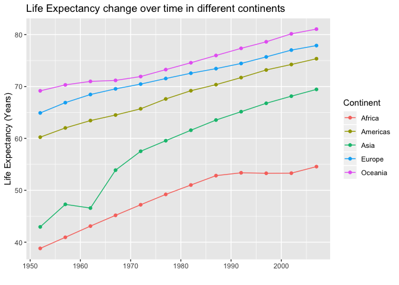

In the plot, we can see life expectancy has increased over the years in
every continent. We can also see that dispite the increase in life
expectancy in Africa, there’s still a really big gap compared to the
rest of the continents.

## 6 Find countries with interesting stories.

I decided to explore the lowest data point of life expectancy in Africa,
which is under 30 years:

``` r
gapminder %>%
  filter(continent %in% "Africa", lifeExp <30) %>%
    select(country,lifeExp, year) %>%
      kable() %>%
        kable_styling(full_width = FALSE, position = "center")
```

<table class="table" style="width: auto !important; margin-left: auto; margin-right: auto;">

<thead>

<tr>

<th style="text-align:left;">

country

</th>

<th style="text-align:right;">

lifeExp

</th>

<th style="text-align:right;">

year

</th>

</tr>

</thead>

<tbody>

<tr>

<td style="text-align:left;">

Rwanda

</td>

<td style="text-align:right;">

23.599

</td>

<td style="text-align:right;">

1992

</td>

</tr>

</tbody>

</table>

After finding this very low value of life expectancy in Rwanda in 1992,
I researched a bit for an explanation of this, and learnt about the
Rwandan Civil War during which many people were killed and therefore,
the impact on this variable.

I want to see how life expectancy in Rwanda behaved before and after
this event:

``` r
Rwanda_t <- gapminder%>%
              filter(country %in% c("Rwanda")) %>%
                select(lifeExp, year)

Rwanda_p <- ggplot(Rwanda_t, aes(year,lifeExp)) +
            labs(y = "Life Expectancy (Years)", #change labels and add title
                 x = "Year", 
                 title = "Historical Life Expectancy in Rwanda") +
            geom_point(color="violet", shape=8) +
            geom_path(alpha=0.2)

grid.arrange(tableGrob(Rwanda_t), Rwanda_p, nrow = 1)
```

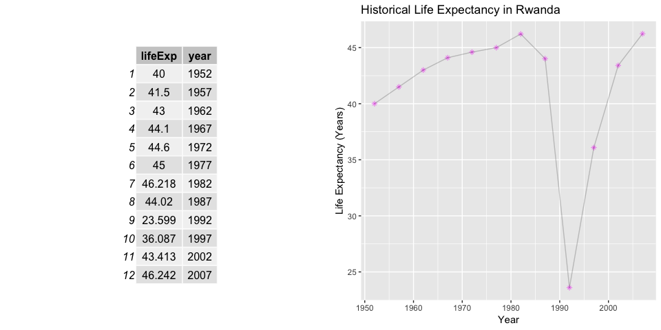

We can see that before this event, the trend of life expectancy was to
go higher, but becaise of this terrible event, life expectancy drop
dramatically and took about 20 years to recover.

I suspect this event also impacted the variable of population:

``` r
Rwanda_pop <- gapminder%>%
              filter(country %in% c("Rwanda")) %>%
              select(pop, year)
  
Rwanda_pop_p <- ggplot(Rwanda_pop, aes(year,pop)) +
                labs(y = "Population", #change labels and add title
                x = "Year", 
                title = "Historical Population in Rwanda") +
                geom_point(color="violet", shape=8) +
                geom_path(alpha=0.2)

grid.arrange(tableGrob(Rwanda_pop), Rwanda_pop_p, nrow = 1)
```

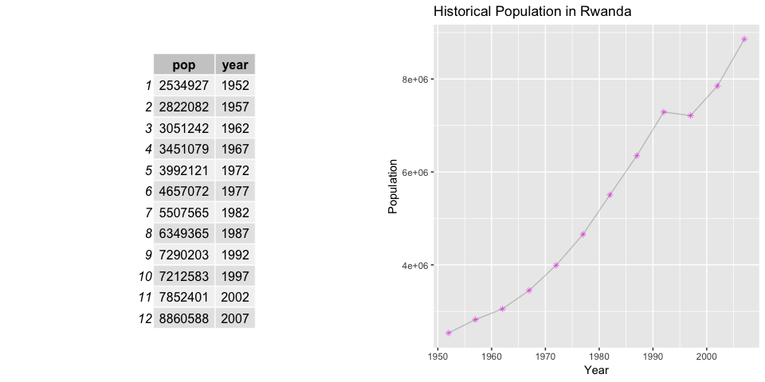

In this graph we can see that not only the population didn’t grow but it
even decreased during this period of Rwanda’s history.
