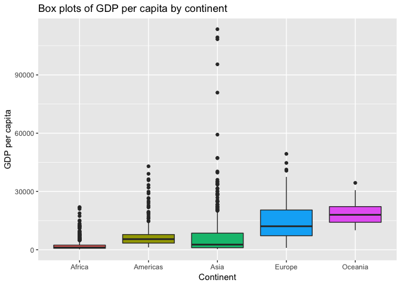

Alejandra\_hw03\_dplyr\_ggplot2
================

## Advance exploration and use of dplyr on the gapminder dataset

This is an R Markdown document used for exploring the `gapminder`
dataset through the functions of the dplyr and ggplot packages. This
document is intented to serve as a “cheatsheet” for future work on R.

## Loading data and required libraries

``` r
library(gapminder)
library(ggplot2)
library(dplyr)
library(kableExtra)
```

In a previous
[repository](https://github.com/STAT545-UBC-students/hw02-aleurcelay/blob/master/hw02_gapminder_dplyr.md)
I described the basics of the gapminder dataset, but here is the top of
the table to rember the idea of it. We can see the variables of the data
set and the first rows.

``` r
kable(head(gapminder)) %>%      #To create a tablle
kable_styling(full_width = FALSE)   #Improve table format           
```

<table class="table" style="width: auto !important; margin-left: auto; margin-right: auto;">

<thead>

<tr>

<th style="text-align:left;">

country

</th>

<th style="text-align:left;">

continent

</th>

<th style="text-align:right;">

year

</th>

<th style="text-align:right;">

lifeExp

</th>

<th style="text-align:right;">

pop

</th>

<th style="text-align:right;">

gdpPercap

</th>

</tr>

</thead>

<tbody>

<tr>

<td style="text-align:left;">

Afghanistan

</td>

<td style="text-align:left;">

Asia

</td>

<td style="text-align:right;">

1952

</td>

<td style="text-align:right;">

28.801

</td>

<td style="text-align:right;">

8425333

</td>

<td style="text-align:right;">

779.4453

</td>

</tr>

<tr>

<td style="text-align:left;">

Afghanistan

</td>

<td style="text-align:left;">

Asia

</td>

<td style="text-align:right;">

1957

</td>

<td style="text-align:right;">

30.332

</td>

<td style="text-align:right;">

9240934

</td>

<td style="text-align:right;">

820.8530

</td>

</tr>

<tr>

<td style="text-align:left;">

Afghanistan

</td>

<td style="text-align:left;">

Asia

</td>

<td style="text-align:right;">

1962

</td>

<td style="text-align:right;">

31.997

</td>

<td style="text-align:right;">

10267083

</td>

<td style="text-align:right;">

853.1007

</td>

</tr>

<tr>

<td style="text-align:left;">

Afghanistan

</td>

<td style="text-align:left;">

Asia

</td>

<td style="text-align:right;">

1967

</td>

<td style="text-align:right;">

34.020

</td>

<td style="text-align:right;">

11537966

</td>

<td style="text-align:right;">

836.1971

</td>

</tr>

<tr>

<td style="text-align:left;">

Afghanistan

</td>

<td style="text-align:left;">

Asia

</td>

<td style="text-align:right;">

1972

</td>

<td style="text-align:right;">

36.088

</td>

<td style="text-align:right;">

13079460

</td>

<td style="text-align:right;">

739.9811

</td>

</tr>

<tr>

<td style="text-align:left;">

Afghanistan

</td>

<td style="text-align:left;">

Asia

</td>

<td style="text-align:right;">

1977

</td>

<td style="text-align:right;">

38.438

</td>

<td style="text-align:right;">

14880372

</td>

<td style="text-align:right;">

786.1134

</td>

</tr>

</tbody>

</table>

According to its documentation, `dplyr` aims to provide a function for
each basic verb of data manipulation:

  - filter( ) to select cases based on their values.
  - arrange( ) to reorder the cases.
  - select( ) and rename( ) to select variables based on their names.
  - mutate( ) and transmute( ) to add new variables that are functions
    of existing variables.
  - summarise( ) to condense multiple values to a single value.
  - sample\_n( ) and sample\_frac( ) to take random samples.

One more function that is not part of the *main* function (I don’t know
why) is:

  - group\_by( ) to put together information based on another variable

So lets, say that we want to:

-----

## 1\. Get the maximum and minimum of GDP per capita for all continents.

We first need to make groups of the continents and then get their
maximum and minimum values of GDP by appliying a `summarise()`
function

``` r
by_continent <- group_by(gapminder, continent) # create a group of the data by continent
gdp_max_min <- summarise(by_continent, # get the max and min values of the gdp variable for each continent
                        max_GDP = max(gdpPercap),
                        min_GDP = min(gdpPercap))
kable(gdp_max_min) %>% #create a table for data display
    kable_styling(full_width = FALSE, position = "center") #improve table format
```

<table class="table" style="width: auto !important; margin-left: auto; margin-right: auto;">

<thead>

<tr>

<th style="text-align:left;">

continent

</th>

<th style="text-align:right;">

max\_GDP

</th>

<th style="text-align:right;">

min\_GDP

</th>

</tr>

</thead>

<tbody>

<tr>

<td style="text-align:left;">

Africa

</td>

<td style="text-align:right;">

21951.21

</td>

<td style="text-align:right;">

241.1659

</td>

</tr>

<tr>

<td style="text-align:left;">

Americas

</td>

<td style="text-align:right;">

42951.65

</td>

<td style="text-align:right;">

1201.6372

</td>

</tr>

<tr>

<td style="text-align:left;">

Asia

</td>

<td style="text-align:right;">

113523.13

</td>

<td style="text-align:right;">

331.0000

</td>

</tr>

<tr>

<td style="text-align:left;">

Europe

</td>

<td style="text-align:right;">

49357.19

</td>

<td style="text-align:right;">

973.5332

</td>

</tr>

<tr>

<td style="text-align:left;">

Oceania

</td>

<td style="text-align:right;">

34435.37

</td>

<td style="text-align:right;">

10039.5956

</td>

</tr>

</tbody>

</table>

After getting those results, I was also interested in knowing the
countries with such maximum and minimum values. While I was doing that I
found another way to do it by applying a filter and specifically search
for such values by keeping the corresponding countries. This method
however, outputs 2 different tables, one for the maximum, and another
for the minimum:

``` r
Max_GDP <- filter(by_continent, gdpPercap == max(gdpPercap)) %>%
                select(continent, country, max_GDP = gdpPercap) %>% # select and/or rename variables
                    arrange(desc(max_GDP)) #re order from high to low
kable(Max_GDP) %>%
    kable_styling(full_width = FALSE, position = "center")
```

<table class="table" style="width: auto !important; margin-left: auto; margin-right: auto;">

<thead>

<tr>

<th style="text-align:left;">

continent

</th>

<th style="text-align:left;">

country

</th>

<th style="text-align:right;">

max\_GDP

</th>

</tr>

</thead>

<tbody>

<tr>

<td style="text-align:left;">

Asia

</td>

<td style="text-align:left;">

Kuwait

</td>

<td style="text-align:right;">

113523.13

</td>

</tr>

<tr>

<td style="text-align:left;">

Europe

</td>

<td style="text-align:left;">

Norway

</td>

<td style="text-align:right;">

49357.19

</td>

</tr>

<tr>

<td style="text-align:left;">

Americas

</td>

<td style="text-align:left;">

United States

</td>

<td style="text-align:right;">

42951.65

</td>

</tr>

<tr>

<td style="text-align:left;">

Oceania

</td>

<td style="text-align:left;">

Australia

</td>

<td style="text-align:right;">

34435.37

</td>

</tr>

<tr>

<td style="text-align:left;">

Africa

</td>

<td style="text-align:left;">

Libya

</td>

<td style="text-align:right;">

21951.21

</td>

</tr>

</tbody>

</table>

``` r
Min_GDP <- filter(by_continent, gdpPercap == min(gdpPercap)) %>%
                select(continent, country, min_GDP = gdpPercap) %>%
                    arrange(min_GDP)    #re order from low to high
kable(Min_GDP) %>%
    kable_styling(full_width = FALSE, position = "center")
```

<table class="table" style="width: auto !important; margin-left: auto; margin-right: auto;">

<thead>

<tr>

<th style="text-align:left;">

continent

</th>

<th style="text-align:left;">

country

</th>

<th style="text-align:right;">

min\_GDP

</th>

</tr>

</thead>

<tbody>

<tr>

<td style="text-align:left;">

Africa

</td>

<td style="text-align:left;">

Congo, Dem. Rep.

</td>

<td style="text-align:right;">

241.1659

</td>

</tr>

<tr>

<td style="text-align:left;">

Asia

</td>

<td style="text-align:left;">

Myanmar

</td>

<td style="text-align:right;">

331.0000

</td>

</tr>

<tr>

<td style="text-align:left;">

Europe

</td>

<td style="text-align:left;">

Bosnia and Herzegovina

</td>

<td style="text-align:right;">

973.5332

</td>

</tr>

<tr>

<td style="text-align:left;">

Americas

</td>

<td style="text-align:left;">

Haiti

</td>

<td style="text-align:right;">

1201.6372

</td>

</tr>

<tr>

<td style="text-align:left;">

Oceania

</td>

<td style="text-align:left;">

Australia

</td>

<td style="text-align:right;">

10039.5956

</td>

</tr>

</tbody>

</table>

-----

## 2\. Look at the spread of GDP per capita within the continents.

Now, lets take a look at the GDP per capita within each continent.

We already have already a variable storing the data grouped by
continents `by_continent`, so the next task to look ad the distribution
of GDP per capita is to plot the data.

``` r
ggplot(by_continent, aes(continent, gdpPercap, colour = year)) +
    geom_jitter() + # sparse the point data to make it more visible
    labs(y = "GDP per capita", x = "Continent", title = "Scatter points of GDP per capita by continent")
```


While this plot allows to see the spread og GDP per capita within each
continent. There are some more elegant ways to do it. One of them is a
box plot:

``` r
ggplot(by_continent, aes(continent, gdpPercap, fill = continent)) +
    geom_boxplot() + # creat boxplot 
    labs(y = "GDP per capita", x = "Continent", title = "Box plots of GDP per capita by continent") + #change labels and add title
    theme(legend.position = "none") #remove legend
```



In general, GDP per capita is higher in Oceania and Europe, and lower in
Africa. However, it is interesting to see oulier countries with high GDP
in particular y Asia.

-----

## 3\. Compute a weighted mean (by population) of life expectancy.

Lets first take a ‘vanilla’ mean of life expectancy (LE) in the Americas
in the last year of data (2007) so we can compared it later with the
weighted
mean.

``` r
Americas_LE <- filter(by_continent, continent == 'Americas', year == '2007') %>% #filter only Americas
                summarize(Mean_LE = mean(lifeExp)) #get the mean life expentancy
kable(Americas_LE) %>%
    kable_styling(full_width = FALSE, position = "center")
```

<table class="table" style="width: auto !important; margin-left: auto; margin-right: auto;">

<thead>

<tr>

<th style="text-align:left;">

continent

</th>

<th style="text-align:right;">

Mean\_LE

</th>

</tr>

</thead>

<tbody>

<tr>

<td style="text-align:left;">

Americas

</td>

<td style="text-align:right;">

73.60812

</td>

</tr>

</tbody>

</table>

The resultant value `73.6` does not take the popoulation of the
countries into consideration. To include it, we can perform a weighted
mean:

``` r
Americas_LE_weighted <- filter(by_continent, continent == 'Americas', year == '2007') %>%
                summarize(Weighted_Mean_LE = weighted.mean(lifeExp, pop)) #get the mean life expentancy weighted by population
kable(Americas_LE_weighted) %>%
    kable_styling(full_width = FALSE, position = "center")
```

<table class="table" style="width: auto !important; margin-left: auto; margin-right: auto;">

<thead>

<tr>

<th style="text-align:left;">

continent

</th>

<th style="text-align:right;">

Weighted\_Mean\_LE

</th>

</tr>

</thead>

<tbody>

<tr>

<td style="text-align:left;">

Americas

</td>

<td style="text-align:right;">

75.35668

</td>

</tr>

</tbody>

</table>

Some of the countries with higher life expentancy in the Americas have
populations large enough to move the average of the continent to `75.4`
years. This is probably becuse of countries like United States, Mexico,
and Canada which are among the most populated countires in the Americas
and have higher life expectancy than the vanilla mean.

``` r
by_continent %>%
    filter(continent == 'Americas', 
            year =='2007', 
            country %in% c('United States', 'Mexico', 'Canada')) %>%
        select(Continent = continent, 
               Country = country, 
               Population = pop, 
               Life_Expectancy = lifeExp) %>%
            kable() %>%
                kable_styling(full_width = FALSE, position = "center")
```

<table class="table" style="width: auto !important; margin-left: auto; margin-right: auto;">

<thead>

<tr>

<th style="text-align:left;">

Continent

</th>

<th style="text-align:left;">

Country

</th>

<th style="text-align:right;">

Population

</th>

<th style="text-align:right;">

Life\_Expectancy

</th>

</tr>

</thead>

<tbody>

<tr>

<td style="text-align:left;">

Americas

</td>

<td style="text-align:left;">

Canada

</td>

<td style="text-align:right;">

33390141

</td>

<td style="text-align:right;">

80.653

</td>

</tr>

<tr>

<td style="text-align:left;">

Americas

</td>

<td style="text-align:left;">

Mexico

</td>

<td style="text-align:right;">

108700891

</td>

<td style="text-align:right;">

76.195

</td>

</tr>

<tr>

<td style="text-align:left;">

Americas

</td>

<td style="text-align:left;">

United States

</td>

<td style="text-align:right;">

301139947

</td>

<td style="text-align:right;">

78.242

</td>

</tr>

</tbody>

</table>

-----

##
